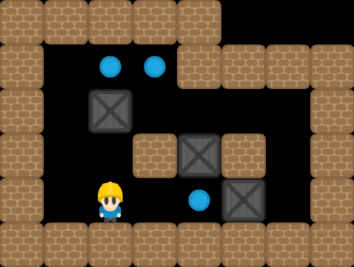
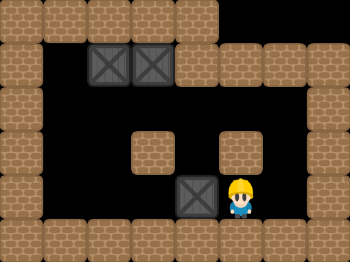

## Sokoban
> Es un clásico rompecabezas inventado en Japón, normalmente implementado como videojuego. El juego original fue creado por Hiroyuki Imabayashi, que en 1980 ganó con su juego una competición contra un ordenador. Hiroyuki Imabayashi es presidente de la empresa Thinking Rabbit Inc. en Japón. Con los años han aparecido muchas versiones del juego para todas las plataformas, y continuamente se crean nuevas colecciones de niveles.

> Sokoban significa "encargado de almacén" en japonés. El objetivo del juego es empujar las cajas (o las bolas) hasta su lugar correcto dentro de un reducido almacén, con el número mínimo de empujes y de pasos. Las cajas se pueden empujar solamente, y no tirar de ellas, y sólo se puede empujar una caja a la vez. Parece fácil, pero los niveles van desde muy fáciles a extremadamente difíciles, y algunos lleva horas e incluso días resolverlos. La simplicidad y la elegancia de las reglas han hecho de Sokoban uno de los juegos de ingenio más populares. - WIKIPEDIA

